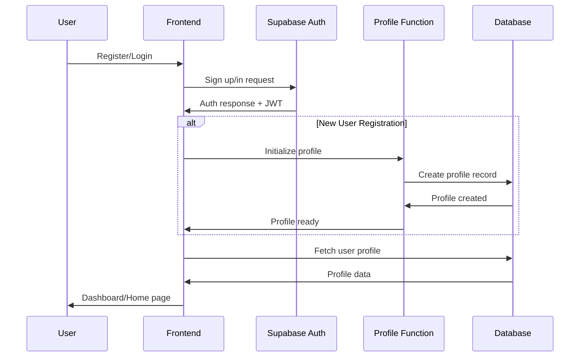
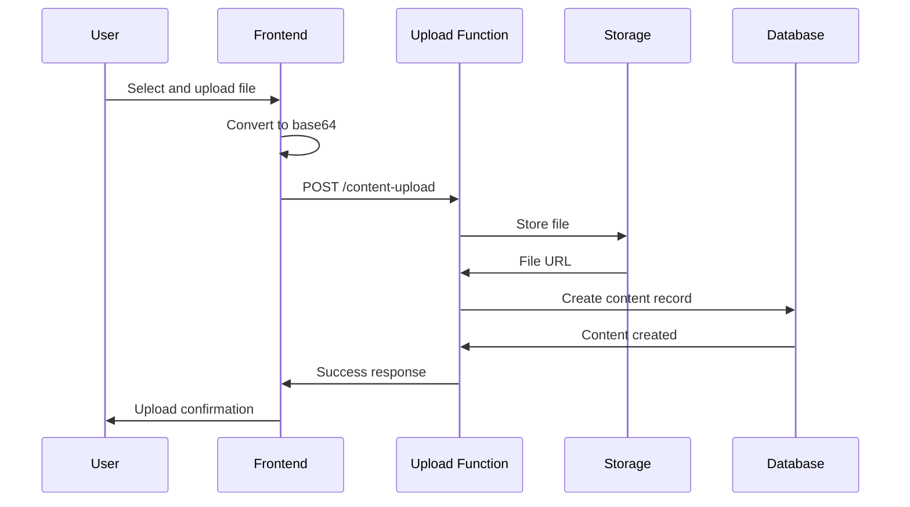

# YourSpace Creative Labs - Architecture Documentation

## Project Structure

```
yourspace-creative-labs/
├── src/
│   ├── components/
│   │   ├── auth/                 # Authentication components
│   │   ├── collaboration/        # Real-time collaboration tools
│   │   ├── effects/             # Visual effects and animations
│   │   ├── epk/                 # Electronic Press Kit builder
│   │   ├── layout/              # Layout components (Header, Sidebar)
│   │   ├── music/               # Audio player and music tools
│   │   ├── payments/            # Payment and monetization UI
│   │   ├── profile/             # Profile customization system
│   │   ├── room/                # Virtual room and 3D interactions
│   │   ├── theme/               # Theme system and customization
│   │   └── ui/                  # Reusable UI components
│   ├── hooks/
│   │   ├── useAuth.tsx          # Authentication management
│   │   ├── useContent.tsx       # Content CRUD operations
│   │   ├── useAnalytics.tsx     # Analytics and metrics
│   │   ├── useCollaboration.tsx # Real-time collaboration
│   │   └── usePayments.tsx      # Payment processing
│   ├── lib/
│   │   ├── supabase.ts          # Supabase client configuration
│   │   ├── stripe.ts            # Stripe payment integration
│   │   ├── theme.ts             # Theme system configuration
│   │   └── utils.ts             # Utility functions
│   ├── pages/
│   │   ├── auth/                # Authentication pages
│   │   ├── create/              # Content creation pages
│   │   ├── discover/            # Content discovery and exploration
│   │   ├── profile/             # User profile pages
│   │   └── studio/              # Creator studio dashboard
│   └── App.tsx                  # Main application component
├── supabase/
│   └── functions/               # Edge functions for backend logic
├── public/                      # Static assets
└── dist/                        # Production build output
```

## Database Schema

### Core Tables

#### profiles
```sql
id UUID PRIMARY KEY
user_id UUID UNIQUE NOT NULL
username VARCHAR(50) UNIQUE NOT NULL
display_name VARCHAR(100)
bio TEXT
avatar_url TEXT
background_image_url TEXT
background_video_url TEXT
theme VARCHAR(50) DEFAULT 'neon-city'
custom_css TEXT
creator_type VARCHAR(50) DEFAULT 'artist'
is_verified BOOLEAN DEFAULT false
is_premium BOOLEAN DEFAULT false
profile_views INTEGER DEFAULT 0
follower_count INTEGER DEFAULT 0
following_count INTEGER DEFAULT 0
total_earnings NUMERIC DEFAULT 0
reputation_score INTEGER DEFAULT 0
created_at TIMESTAMP WITH TIME ZONE DEFAULT now()
updated_at TIMESTAMP WITH TIME ZONE DEFAULT now()
```

#### content
```sql
id UUID PRIMARY KEY DEFAULT gen_random_uuid()
creator_id UUID NOT NULL
title VARCHAR(255) NOT NULL
description TEXT
content_type VARCHAR(50) NOT NULL
file_url TEXT
thumbnail_url TEXT
file_size INTEGER
mime_type VARCHAR(100)
duration INTEGER
is_public BOOLEAN DEFAULT true
is_premium BOOLEAN DEFAULT false
download_count INTEGER DEFAULT 0
view_count INTEGER DEFAULT 0
like_count INTEGER DEFAULT 0
comment_count INTEGER DEFAULT 0
price NUMERIC DEFAULT 0
commission_enabled BOOLEAN DEFAULT false
vibe_tags ARRAY
remix_parent_id UUID
created_at TIMESTAMP WITH TIME ZONE DEFAULT now()
updated_at TIMESTAMP WITH TIME ZONE DEFAULT now()
```

#### collaborations
```sql
id UUID PRIMARY KEY DEFAULT gen_random_uuid()
title VARCHAR(255) NOT NULL
description TEXT
type VARCHAR(20) NOT NULL
created_by UUID NOT NULL
status VARCHAR(20) DEFAULT 'active'
max_participants INTEGER DEFAULT 10
current_participants INTEGER DEFAULT 1
invite_code VARCHAR(50) UNIQUE
settings JSONB DEFAULT '{}'
room_data JSONB DEFAULT '{}'
created_at TIMESTAMP WITH TIME ZONE DEFAULT CURRENT_TIMESTAMP
updated_at TIMESTAMP WITH TIME ZONE DEFAULT CURRENT_TIMESTAMP
```

## API Endpoints

### Supabase Edge Functions

#### `/functions/v1/content-upload`
- **Method:** POST
- **Purpose:** Handle content file uploads to storage
- **Authentication:** Required
- **Payload:**
  ```json
  {
    "fileData": "base64_encoded_file",
    "fileName": "example.jpg",
    "title": "Content Title",
    "description": "Content description",
    "contentType": "image",
    "tags": ["vaporwave", "neon"],
    "isPublic": true
  }
  ```

#### `/functions/v1/initialize-user-profile`
- **Method:** POST
- **Purpose:** Create initial user profile after registration
- **Authentication:** Required
- **Payload:**
  ```json
  {
    "username": "creator123",
    "displayName": "Creative Artist",
    "bio": "Digital artist and musician"
  }
  ```

#### `/functions/v1/initialize-room-objects-fixed`
- **Method:** POST
- **Purpose:** Set up default virtual room objects for new users
- **Authentication:** Required
- **Payload:** `{}`

## Authentication Flow



## Content Upload Flow



## Theme System

### Available Themes
- `neon-city` - Purple and pink neon with dark background
- `cyber-blue` - Blue and cyan cyberpunk aesthetic
- `retro-wave` - Pink and purple vaporwave styling
- `matrix-green` - Green matrix-style theme

### Custom CSS Support
Users can add custom CSS to their profiles for advanced customization:

```css
/* Example custom profile CSS */
.profile-container {
  background: linear-gradient(45deg, #ff006e, #8338ec);
}

.content-grid {
  filter: drop-shadow(0 0 10px rgba(131, 56, 236, 0.5));
}
```

## Component Architecture

### Custom Hooks
- **useAuth**: Authentication state and methods
- **useContent**: Content CRUD operations
- **useCollaboration**: Real-time collaboration features
- **usePayments**: Payment processing and monetization
- **useAnalytics**: User engagement and performance metrics

### Context Providers
- **AuthProvider**: Global authentication state
- **ThemeProvider**: Theme customization and switching
- **MusicPlayerProvider**: Global audio player state

### Reusable Components
- **LoadingSpinner**: Consistent loading indicators
- **ProtectedRoute**: Route-level authentication guards
- **Layout**: Main application layout with navigation
- **VirtualRoom**: 3D interactive room component

## Deployment Configuration

### Build Commands
```bash
# Development
npm run dev

# Production build
npm run build:prod

# Preview production build
npm run preview
```

### Environment Variables
```env
VITE_SUPABASE_URL=https://your-project.supabase.co
VITE_SUPABASE_ANON_KEY=your-anon-key
VITE_STRIPE_PUBLISHABLE_KEY=pk_test_...
```

### Performance Optimizations
- Code splitting with React.lazy()
- Asset optimization with Vite
- Image lazy loading
- Component memoization where appropriate
- Efficient database queries with proper indexing

---

*Architecture documentation for YourSpace Creative Labs Phase 1*